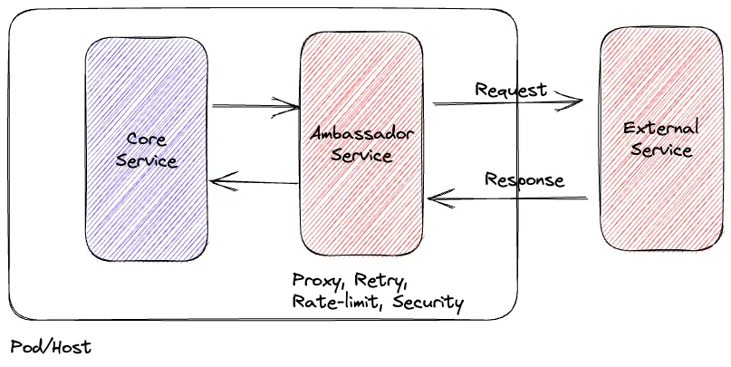

# Introduction

* Lightweight proxy (ambassador) deployed **co-located** with a client (same host/pod) that forwards requests to remote services.
* Acts as a local adapter: hides network, auth, resiliency and observability logic from the client.
* Commonly implemented as a sidecar container, local daemon, or per-host proxy.

# Problem that it tries to solve

* Keeps client code simple by **offloading cross-cutting network concerns** (retries, timeouts, TLS, logging).
* Avoids scattering duplicate network/telemetry/auth logic across many clients.
* Reduces client’s coupling to remote service APIs and changes.
* Improves latency and reliability by making client→proxy calls local (intra-host) while proxy handles remote calls.

# Scenarios when to use it

* Clients need common networking behavior (retries, circuit breakers, backoff, metrics) without embedding it.
* You want per-client or per-pod isolation for resiliency and configuration.
* Running in container orchestration (e.g., Kubernetes) where sidecar deployment is easy.
* You need to instrument or trace outbound calls per service with fine granularity.
* You want to enforce client-specific routing or transform requests before reaching a remote service.

# Issues and considerations with this pattern

* **Duplication / resource overhead:** many ambassador instances consume CPU/memory; manage with automation or lighter proxies.
* **Operational complexity:** need tooling for consistent config, updates, and visibility across many proxies.
* **Blast radius vs. central control trade-off:** sidecars isolate failures but make enforcing a single global policy (e.g., global API quota) harder.
* **Configuration drift:** per-instance configs can diverge unless managed (use config distribution or service mesh control plane).
* **Latency / hop overhead:** local calls are low cost, but proxy adds one extra hop before the remote call; weigh against benefits.
* **Security handling:** secrets injection and trust boundaries must be designed (sidecars share pod trust; host daemons share node trust).
* **When not suitable:** if you need strict centralized quota enforcement, deduplication, or single-point caching, a centralized gateway/façade may be a better fit.

Here’s a **concise, one-page comparison table and diagram summary** of the **Ambassador Pattern vs. Centralized Gateway** — perfect as a reference sheet.

---

## 🧭 **Ambassador Pattern vs. Centralized Gateway**

| Aspect                     | **Ambassador Pattern (co-located)**                               | **Centralized Gateway (shared service)**               |
| -------------------------- | ----------------------------------------------------------------- | ------------------------------------------------------ |
| **Deployment**             | Deployed *with each client* (same pod/host, e.g., sidecar)        | Single shared service between clients and remote APIs  |
| **Communication**          | Client → **local** ambassador → remote service                    | Client → **remote** gateway → external service         |
| **Latency**                | Very low (local IPC or loopback)                                  | Slightly higher (extra network hop)                    |
| **Fault Isolation**        | Failure affects only one client                                   | Gateway failure can affect many clients                |
| **Scalability**            | Scales automatically with each client                             | Must scale centrally for all clients                   |
| **Config Independence**    | Each client can have custom retry, timeout, routing               | All clients share centralized config                   |
| **Cross-cutting Concerns** | Handled locally (per service)                                     | Handled globally (once in gateway)                     |
| **Security Boundary**      | Ambassador shares host/pod trust boundary                         | Gateway enforces org-wide policies                     |
| **Use When**               | You need per-client resiliency, local observability, or isolation | You need global authentication, rate limiting, caching |
| **Typical Implementation** | Sidecar proxy (e.g., Envoy, Linkerd, Consul Connect)              | API gateway or edge proxy (e.g., Kong, NGINX, Apigee)  |

---

# Diagrams

# References

## 📚 Official Documentation
- [Microsoft Learn – Ambassador pattern](https://learn.microsoft.com/en-us/azure/architecture/patterns/ambassador)

---

## 🧩 Related Patterns and References
- [Microsoft Learn – API Gateway pattern](https://learn.microsoft.com/en-us/azure/architecture/patterns/api-gateway)  
- [Microsoft Learn – Gateway Aggregation pattern](https://learn.microsoft.com/en-us/azure/architecture/patterns/gateway-aggregation)  
- [Microsoft Learn – Gateway Offloading pattern](https://learn.microsoft.com/en-us/azure/architecture/patterns/gateway-offloading)

---

## ⚙️ Service Mesh / Sidecar Implementations (Ambassador-style)
- [Envoy Proxy – Official site](https://www.envoyproxy.io/)  
- [Istio – Service mesh with sidecar proxies](https://istio.io/)  
- [Linkerd – Lightweight service mesh](https://linkerd.io/)  
- [Consul Connect – HashiCorp service mesh](https://developer.hashicorp.com/consul/docs/connect)

