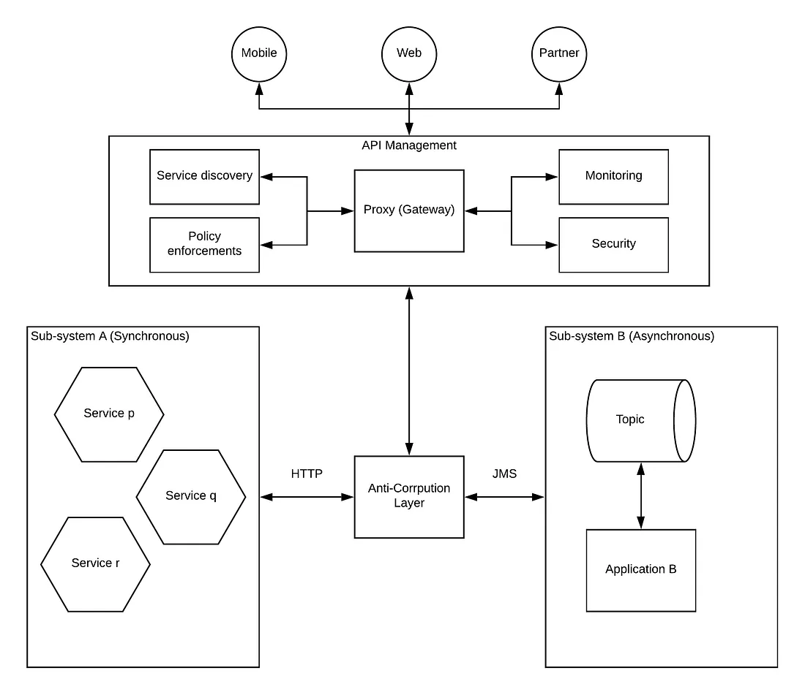
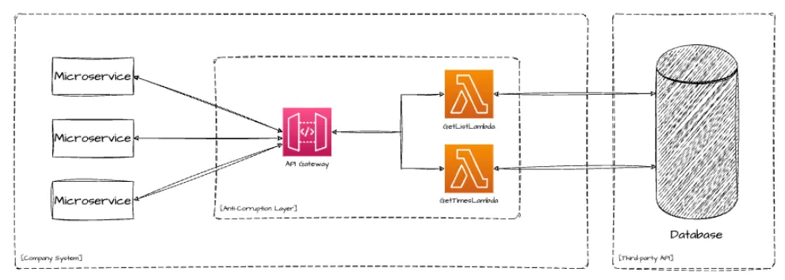

# Introduction

- The **Anti-Corruption Layer (ACL)** is an architectural pattern used to **isolate and protect one subsystem or bounded context** from the influence of another, often legacy or external, system. It acts as a **protective translation layer**, ensuring that the internal domain model remains consistent and independent from external models that may have different semantics, data structures, or design philosophies.

- Originally popularized by **Eric Evans** in *Domain-Driven Design (DDD)*, the ACL enables a clean separation between systems by transforming data and requests between them, preserving the integrity of the core domain.

# Problem that it tries to solve

When integrating with external or legacy systems, the internal domain model can become **polluted** by external representations, APIs, or business logic inconsistencies. This pollution may lead to:

- Tight coupling between systems.  
- Loss of domain integrity due to direct data mapping.  
- Difficulties in evolving or refactoring the internal model.  
- Increased complexity in testing and maintenance.

The Anti-Corruption Layer mitigates these risks by introducing a **translator or adapter boundary** that converts between the internal and external models, allowing each to evolve independently.

# Scenarios when to use it

The ACL pattern is particularly useful when:

- **Integrating with legacy systems** whose models or APIs cannot be changed.  
- **Migrating gradually** from a monolith to microservices or between architectures.  
- **Connecting systems owned by different teams or organizations**, where domain models differ.  
- **Interfacing with third-party APIs** that may have unstable or unclear contracts.  
- **Protecting a new DDD-based bounded context** from older, less-structured ones.

Example:  
In an enterprise application, a modern microservice responsible for customer management might need to interact with an older ERP system. An ACL would translate ERP-specific representations into domain objects, preventing the ERP’s schema or logic from leaking into the microservice.

# Issues and considerations with this pattern

While the Anti-Corruption Layer is powerful, it introduces several trade-offs:

| **Issue / Consideration** | **Description** |
|----------------------------|-----------------|
| **Increased complexity** | Adds extra components (translators, adapters, facades) that must be designed, implemented, and maintained. |
| **Performance overhead** | Data translation and mapping can introduce latency or overhead, especially with high-frequency integrations. |
| **Maintenance cost** | Changes in the external system require updates in the ACL’s translation logic. |
| **Duplication risk** | The ACL might replicate some logic already existing in the external system. |
| **Boundary design** | Requires careful definition of where to draw boundaries and how to structure translation responsibilities. |

Despite these costs, the ACL often pays off in large, long-lived systems where model integrity is crucial.

# Comparison: Anti-Corruption Layer vs. Adapter Pattern

| **Aspect** | **Anti-Corruption Layer** | **Adapter Pattern** |
|-------------|----------------------------|----------------------|
| **Scope** | Architectural, between subsystems or bounded contexts. | Design-level, between incompatible interfaces. |
| **Purpose** | Prevent domain corruption by translating between models. | Allow one object to work with another’s interface. |
| **Complexity** | Higher, may include multiple components and translation logic. | Lower, typically a single class implementing an interface. |
| **Context of use** | System integration, especially between heterogeneous domains. | Object-level compatibility within a single system. |
| **Origin** | Domain-Driven Design (DDD). | GoF Structural Pattern. |

The Adapter pattern can be part of an ACL implementation, but ACL encompasses broader architectural concerns beyond simple interface compatibility.

# Diagrams

# References

## Official Documentation
- [Domain-Driven Design: Tackling Complexity in the Heart of Software – Eric Evans (Addison-Wesley, 2003)](https://www.domainlanguage.com/ddd/)
- [Microsoft Learn: Anti-Corruption Layer Pattern](https://learn.microsoft.com/en-us/azure/architecture/patterns/anti-corruption-layer)

## Related Patterns and References
- [Adapter Pattern (Gang of Four)](https://refactoring.guru/design-patterns/adapter)
- [Facade Pattern](https://refactoring.guru/design-patterns/facade)
- [Bounded Context (DDD Concept)](https://martinfowler.com/bliki/BoundedContext.html)
- [Integration Patterns – Enterprise Integration Patterns](https://www.enterpriseintegrationpatterns.com/)

## Implementations or Examples
- **Microsoft Azure Architecture Center**: Example of ACL used for integrating microservices with legacy systems.  
- **DDD Sample App by Vaughn Vernon**: Demonstrates ACL between separate bounded contexts.  
- [GitHub: DDD Sample – Cargo Tracking Application](https://github.com/citerus/dddsample-core) – shows domain isolation principles similar to ACL.
